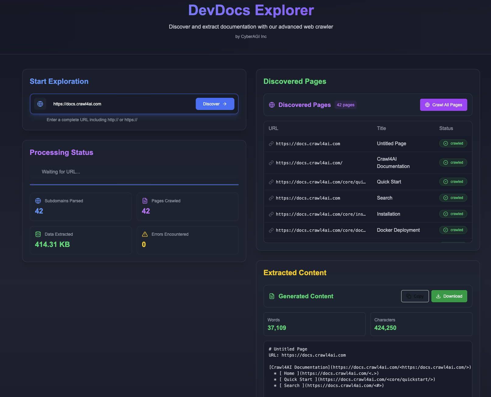

# DevDocs 🚀

A powerful documentation crawler and extractor that helps you discover, crawl, and convert web documentation into clean markdown format. Built with Next.js, FastAPI, and Crawl4AI.

Why?: This is from a personal frustration of mine, coding with LLM is great but the knowledge they use is old and technology is developing at a fast rate. So how do you bring in the latest knowledge base of a technology in the hands of a powerful model? DevDocs!
What I wanted to build is a simple platform that can take a parent URL of a documentation page, spider through all its relevent webpages like /learn /quickstart /API etc. and convert them into markdown for me to add into my MCP server. 

This is V1 of DevDocs, eventually I will be adding MCP servers, Shareable Vector Database, Agents which will be pros in particular documentation and can code for you. 
Stay tuned. 



## ✨ Features

- 🔍 **Smart Discovery**: Automatically finds and maps all related documentation pages
- 📝 **Markdown Conversion**: Converts web content into clean, readable markdown
- 🌐 **Deep Crawling**: Intelligently navigates through complex documentation structures
- 🎯 **Precision Extraction**: Focuses on meaningful content while filtering out noise
- 🚄 **Real-time Progress**: Live updates on crawling progress and statistics
- 💫 **Modern UI**: Sleek, responsive interface with real-time feedback

## 🏗️ Architecture

### Frontend (Next.js + TypeScript)
- Modern React components with TypeScript
- Real-time state management with React hooks
- Tailwind CSS for styling
- Shadcn UI components for consistent design

### Backend (FastAPI + Python)
- FastAPI for high-performance async API
- Crawl4AI for intelligent web crawling
- Advanced error handling and recovery
- Session management for reliable crawling

## 🚀 Getting Started

### Prerequisites
- Node.js 18+
- Python 3.12+
- npm or yarn
- pip

### Installation

1. Clone the repository:
```bash
git clone https://github.com/cyberagiinc/DevDocs.git
cd DevDocs
```

2. Install frontend dependencies:
```bash
npm install
# or
yarn install
```

3. Install backend dependencies:
```bash
cd backend
pip install -r requirements.txt
```

### Running the Application

1. Start the backend server:
```bash
cd backend
uvicorn app.main:app --host 0.0.0.0 --port 24125 --reload
```

2. Start the frontend development server:
```bash
# In another terminal
npm run dev
# or
yarn dev
```

3. Open [http://localhost:3000](http://localhost:3000) in your browser

## 💡 How to Use

1. Enter a documentation URL (e.g., https://docs.example.com)
2. Click "Discover" to find all related pages
3. Review the discovered pages in the list
4. Click "Crawl All Pages" to extract content
5. Download or copy the generated markdown

## 🧩 Key Components

### Frontend Components
- `UrlInput`: URL validation and submission
- `SubdomainList`: Displays discovered pages
- `ProcessingBlock`: Shows crawling progress
- `MarkdownOutput`: Displays extracted content

### Backend Services
- `/api/discover`: Finds related documentation pages
- `/api/crawl`: Extracts and converts content to markdown
- Error handling and recovery
- Session management

## 🛠️ Development

### Project Structure
```
.
├── app/                  # Next.js app directory
│   ├── api/             # API routes
│   └── page.tsx         # Main page component
├── backend/             # Python backend
│   ├── app/            # FastAPI application
│   │   ├── main.py     # Server entry point
│   │   └── crawler.py  # Crawling logic
│   └── requirements.txt # Python dependencies
├── components/          # React components
├── lib/                 # Shared utilities
└── public/             # Static assets
```

### Adding New Features
1. Create new components in `components/`
2. Add API endpoints in `backend/app/`
3. Update types in `lib/types.ts`
4. Add tests as needed

## 📝 API Documentation

### Discover Endpoint
- `POST /api/discover`
- Input: `{ url: string }`
- Output: `{ pages: DiscoveredPage[], message: string }`

### Crawl Endpoint
- `POST /api/crawl`
- Input: `{ pages: DiscoveredPage[] }`
- Output: `{ markdown: string, stats: CrawlStats }`

## 🤝 Contributing

1. Fork the repository
2. Create a feature branch
3. Commit your changes
4. Push to the branch
5. Open a Pull Request

## 📄 License

Apache-2.0 license

---

Built with ❤️ by CyberAGI Inc. | [Report Issues](https://github.com/yourusername/DevDocs/issues)
